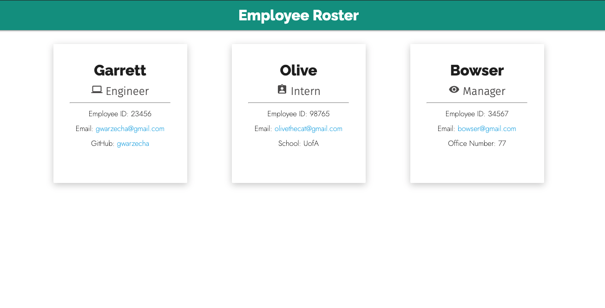

  # Team Profile Generator
  

  
  ## Description: 

  Generates a a team roster based on provided criteria that the user selects from. The profile of each employee is displayed on a card which shows their role, provides a link to their email, github, along with other useful information that pertains to the employee. 

  ## Media

  
  
  

  

   

  ## Table of Contents:
  * [Installation](#installation)
  * [Usage](#usage)
  * [Contributing](#contributing)
  * [Tests](#tests)
  * [Questions?](#questions)
  
  ## Installation: 
 
  Clone the repo and run 'npm install'
  

  
  ## Usage: 

  To begin generating a team profile, run 'node index' in the command line. 
  

  
  ## Contributing: 

  If you have any suggestions for improvement, please create a pull request and share any ideas you may have. 
  

  
  ## Tests: 

  'npm run test' can be utilized for testing, the application uses the Jest package for testing purposes. 
  

  
  ## Questions?:
  * <a href="https://github.com/gwarzecha" target="_blank">GitHub</a>
  * <a href="mailto: gmwarzecha@gmail.com" target="_blank">Email</a>
  
  ## License: 

  This project is covered under the MIT license.